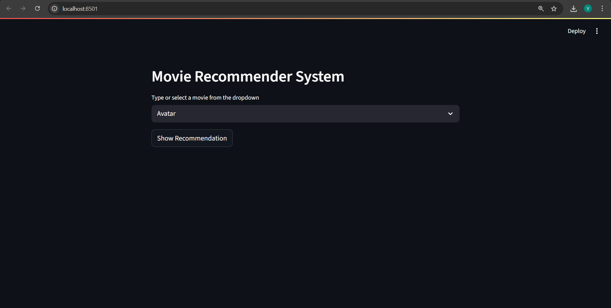
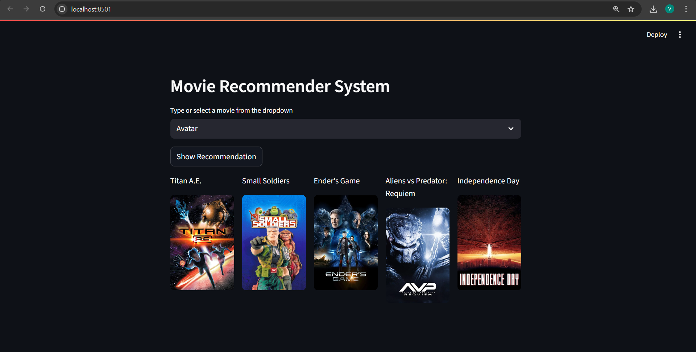

# 🎬 Movie Recommender System

A sleek and simple **Content-Based Movie Recommender System** built with **Python** and **Streamlit**. It suggests movies similar to the one selected by the user based on metadata like genres, keywords, cast, and crew. Posters are fetched live from the TMDb API.

---

## 🚀 Features

- 🔍 Search or select a movie from the dropdown
- 🎯 Get top 5 similar movie recommendations
- 🖼️ Movie posters fetched using **TMDb API**
- 🧠 Based on content similarity (not ratings)
- ⚡ Fast and interactive interface built with **Streamlit**

---

## 🛠️ Tech Stack

- **Python**
- **Pandas**, **NumPy**, **Scikit-learn**, **NLTK**
- **Streamlit** (for UI)
- **TMDb API** (for movie posters)
- **Pickle** (for storing model data)

---

## 📂 Project Structure

```
movie-recommender-system/
│
├── app.py                       # Main Streamlit app
├── requirements.txt             # Python dependencies
├── movie-recommender-system.ipynb  # Model development notebook
├── .gitignore                   # Ignored files/folders
└── README.md                    # Project overview
```

> ❌ `model/` folder containing `.pkl` files is excluded due to GitHub file size restrictions

---

## 🖥️ Screenshots

| Movie Selection | Recommendations |
|-----------------|------------------|
|  |  |

> 📸 Add your screenshots in a folder named `screenshots/` inside the repo

---

## 📦 Setup Instructions

Clone the repository and install the dependencies:

```bash
git clone https://github.com/vaibhavgaikwad01/movie-recommender-system.git
cd movie-recommender-system
pip install -r requirements.txt
streamlit run app.py
```

---

## ⚠️ Note

This project requires the following files to be added **locally** in a `model/` directory:

```
model/movie_list.pkl
model/similarity.pkl
```

These files are generated using the notebook and are not included on GitHub due to size restrictions.

---

## 🙋‍♂️ Author

**Vaibhav Gaikwad**  
🌐 [GitHub](https://github.com/vaibhavgaikwad01)

---

## ⭐ Show Your Support

If you found this project helpful or inspiring, please ⭐ star the repo and consider sharing it!
